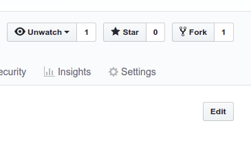
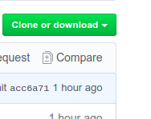
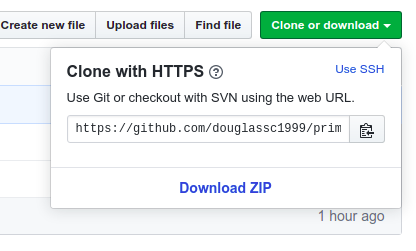
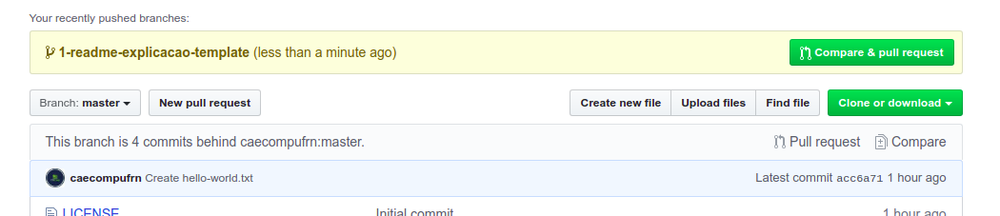
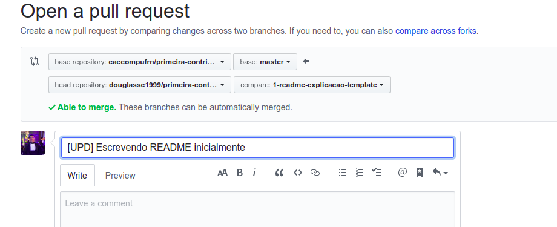

# Primeira Contribuição

Este é o primeiro repositório e projeto do Github do Centro Acadêmico de Engenharia de computação. Com ele esperamos iniciar e compartilhar projetos de vários tipos com os alunos que estão e que virão para o curso. 

Sabemos que alguns podem não ter tido contato ainda com o git ou o github, queremos que você dê o primeiro passo com esse projeto, e para isso vamos ensinar aqui como contribuir com esse projeto *open source*, para isso, siga as instruções a seguir:

#### *Este tutorial é fortemente inspirado neste [repositório](https://github.com/firstcontributions/first-contributions/blob/master/translations/README.pt_br.md)*
 



Se não possui o git em sua máquina, [instale-o aqui]( https://help.github.com/articles/set-up-git/ ).

## Faça um Fork deste repositório

Faça um Fork clicando no botão "Fork" no topo desta página. Isto irá criar uma cópia deste repositório na sua conta.

## Clone o repositório



Agora clone este repositório para a sua máquina. Clique no botão "Clone or download" e, em seguida, clique no ícone "Copy to clipboard" para copiar a URL.

Abra seu terminal e execute o seguinte comando do git:
```
git clone "url que copiou"
```
onde "url que copiou" (sem as aspas) é a URL deste repositório. Consulte as etapas anteriores para obter a URL.



Por exemplo:
```
git clone https://github.com/seu-usuario/primeira-contribuicao.git
```
onde "seu-usuário" é o seu usuário do GitHub. Aqui você está copiando o conteúdo do repositório primeira-contribuicao para o seu computador.

## Crie um Branch

Vá para o diretório do repositório no seu computador (caso você não esteja lá):
```
cd first-contributions
```

Agora crie um Branch usando o comando `git checkout`:
```
git checkout -b <add-seu-nome>
```

Por exemplo:
```
git checkout -b add-carlos-viegas
```
Obs.: O nome do Branch não precisa ter a sigla "add", mas nesse caso é recomendável, porque a finalidade deste Branch é a de adicionar o seu nome a uma lista.

## Efetue as alterações necessárias e faça um Commit

Agora abra o arquivo `hello-world.txt` em seu editor de código, adicione o seu nome a ele e salve o arquivo. 

Se você for para o diretório do projeto e executar o comando `git status`, verá que há alterações. Adicione essas alterações ao Branch que você acabou de criar utilizando o comando `git add`:
```
git add hello-world.txt
```
Agora faça um Commit dessas alterações utilizando o comando `git commit`:
```
git commit -m "Add <seu-nome> a lista"
```
preenchendo `<seu-nome>` com o seu nome.

## Faça um Push das alterações para o GitHub

Faça um Push utilizando o comando `git push`:
```
git push origin <add-seu-nome>
```
substituindo `<add-seu-nome>` pelo nome do Branch que você criou anteriormente.

## Envie suas alterações para serem revisadas

Se você for para o seu repositório no GitHub, verá um botão `Compare & pull request`. Clique nesse botão.



Agora envie um Pull Request.



Logo estarei mesclando ('mergeando') as suas mudanças no Branch principal (master) deste projeto. Você receberá um e-mail de notificação quando as alterações forem mescladas.
